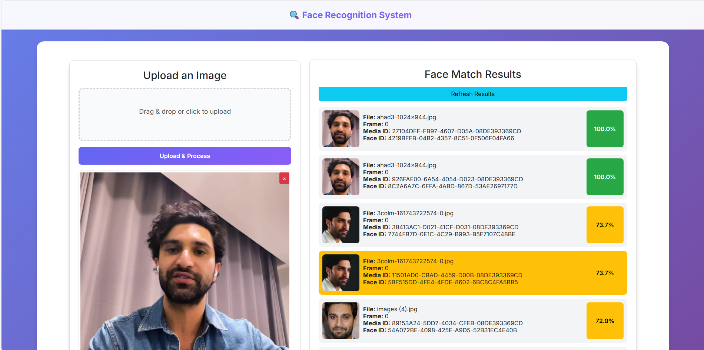

# Face Search

This project processes uploaded images, detects faces, generates embeddings, and matches them against stored face data using clustering and similarity search.



---

## 🔧 Requirements

* **Python**: `3.8.20` (important — other versions may cause TensorFlow issues)
* **Visual Studio**: Build the API project first (required for image upload & URL access)

### Python dependencies

```bash
pip install numpy opencv-python pyodbc requests python-dotenv retina-face keras-facenet scikit-learn
```

---

## ▶️ How to Run

### 1. Build the API (Visual Studio)

* Open the solution in **Visual Studio**
* Build and run the project
* Ensure the API is running and accessible (used to fetch image URLs)

---

### 2. Run the Python script

```bash
python main.py
```

This will:

* Poll the API for newly uploaded images
* Fetch image URLs
* Process faces and find matches
* Save results to `wwwroot/results/latest_match.json`

---

## 🖼️ Image Upload Flow

1. Images are uploaded via the API
2. The API **stores and exposes image URLs**
3. The Python service:

   * Calls the API
   * Gets the image URL
   * Downloads the image in-memory
   * Processes face matching

> ⚠️ If required, ensure the API **POST endpoint returns the image URL** so the Python service can process it.

---

## 📂 Entry Point

* **Main file**: `main.py`

---
